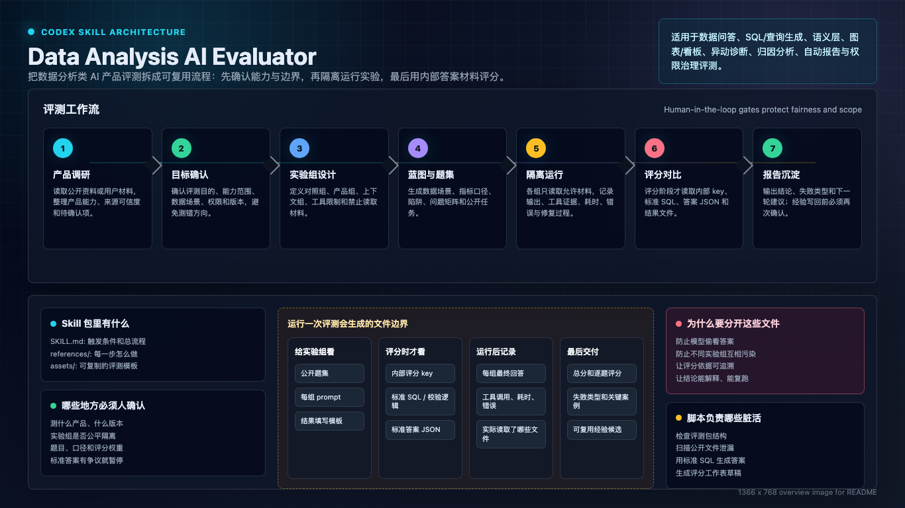

# Data Analysis AI Evaluator

Design and run evaluations for AI products that support data analysis workflows, including natural-language data Q&A, query generation, semantic layers, chart/dashboard generation, anomaly diagnosis, attribution analysis, automated reporting, permission governance, and end-to-end product flows.

This repository is a Codex skill package. The core agent instructions live in `SKILL.md`; detailed procedures live in `references/`; reusable templates live in `assets/`; deterministic helper checks live in `scripts/`.

## 中文简介

数据分析 AI 产品评测器是一个 Codex skill，用来设计和运行数据分析类 AI 产品评测。它适用于数据问答、SQL 或查询生成、语义层、图表和看板生成、异动诊断、归因分析、自动报告、权限治理和完整产品链路评估。核心方法是先调研产品公开能力，再由人确认评测目标、实验组、数据场景、问题矩阵和评分体系，最后生成隔离的公开题集、内部评分 key、标准答案、实验 prompt 和评分报告。

关键词：数据分析评测、AI 产品评测、数据问答、SQL 生成、查询生成、语义层、指标口径、图表生成、看板生成、异动诊断、归因分析、自动报告、权限治理、评测隔离、human-in-the-loop、评分体系、标准答案、评测包。

## What This Skill Helps With

- Research a product's public data-analysis capabilities before designing an evaluation.
- Confirm evaluation goals, experiment groups, data scenarios, question matrices, and scoring rules with a human reviewer.
- Generate separated public questions, internal scoring keys, standard answers, group prompts, result templates, and final scoring reports.
- Preserve evaluation integrity by separating public inputs from internal answers and scoring materials.
- Capture reusable learnings only after human confirmation.

## Directory Layout

```text
data-analysis-ai-evaluator/
├── SKILL.md
├── agents/
├── assets/
├── examples/
├── references/
└── scripts/
```

Recommended generated evaluation pack layout:

```text
eval-pack/
├── product_eval_brief.md
├── experiment_and_scoring_plan.md
├── evaluation_blueprint.md
├── questions/
│   ├── common_questions.yaml
│   └── scoring_key_internal.yaml
├── standard_sql/
├── answers/
├── prompts/
├── templates/
├── scoring_rubric.md
└── results/
```

`questions/common_questions.yaml` is public to experiment runners. `questions/scoring_key_internal.yaml`, `standard_sql/`, `answers/`, and prior `results/` are internal materials and should only be read during scoring.

## Helper Scripts

The scripts are lightweight guardrails, not a full scoring engine.

```bash
python3 -m pip install -r requirements.txt
python3 scripts/validate_eval_pack.py examples/minimal_eval_pack
python3 scripts/check_leakage.py assets/common_questions.template.yaml assets/group_prompts.template.md
python3 scripts/validate_eval_pack.py path/to/eval-pack
python3 scripts/check_leakage.py path/to/public/file-or-dir
python3 scripts/check_leakage.py --strict path/to/public/file-or-dir
python3 scripts/generate_answer_json.py --database path/to/data.duckdb --sql-dir path/to/standard_sql --output-dir path/to/answers
python3 scripts/score_results.py --results path/to/results/group_a_result.md --output path/to/results/scoring_worksheet.md
```

`generate_answer_json.py` opens DuckDB databases in read-only mode and rejects non-read-only SQL by default. Only run it against trusted local SQL and databases; generated answer JSON can contain sensitive rows and should usually stay out of Git.

## Offline Or Restricted Environments

The skill normally starts by researching public product materials. If network access, product docs, private dashboards, or accounts are unavailable, use only the user-provided materials. Mark unverified product capabilities as `待确认` and do not infer unsupported features.

## Evaluation Integrity Rules

- Public question files must not include standard answers, standard queries, common errors, or scoring hints.
- Experiment runners must not read internal scoring keys, standard answers, standard queries, prior group outputs, or final scoring reports.
- Scoring happens after experiment outputs are complete and may read internal materials.
- Ambiguous questions should be marked for clarification instead of forced into an answer.
- Sensitive or unauthorized requests should be refused with a safe alternative.

## Open Source Notes

Before publishing your own evaluation packs, remove private product docs, credentials, local absolute paths, proprietary datasets, and generated answer keys that should not be shared.

This repository includes `.gitignore` rules for common generated evaluation artifacts, but review staged files before every public release:

```bash
git status --short
git diff --cached --stat
git diff --cached
python3 scripts/validate_eval_pack.py examples/minimal_eval_pack
python3 scripts/check_leakage.py examples/minimal_eval_pack/questions/common_questions.yaml
```

Do not publish private evaluation packs unless you have removed or regenerated internal answers, standard SQL, proprietary datasets, raw model outputs, credentials, and local paths.
